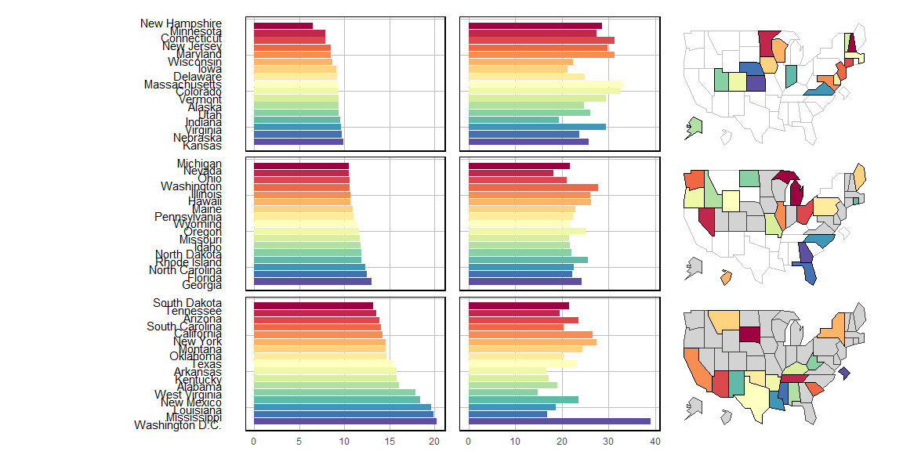
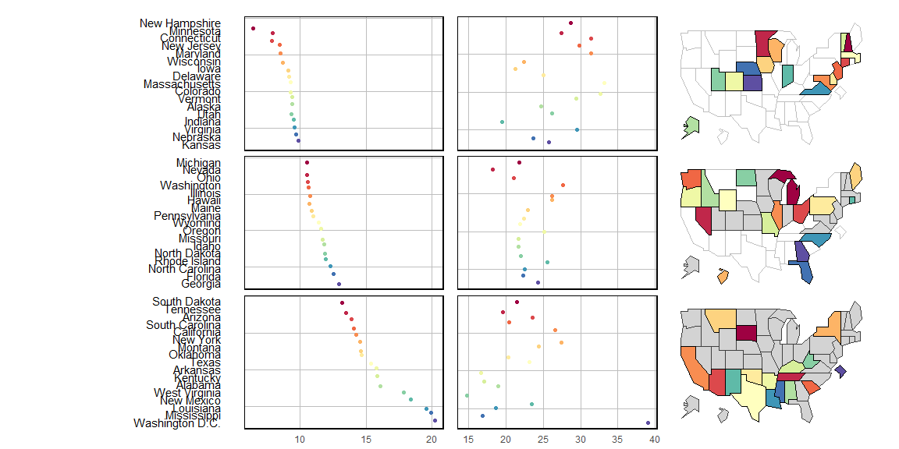
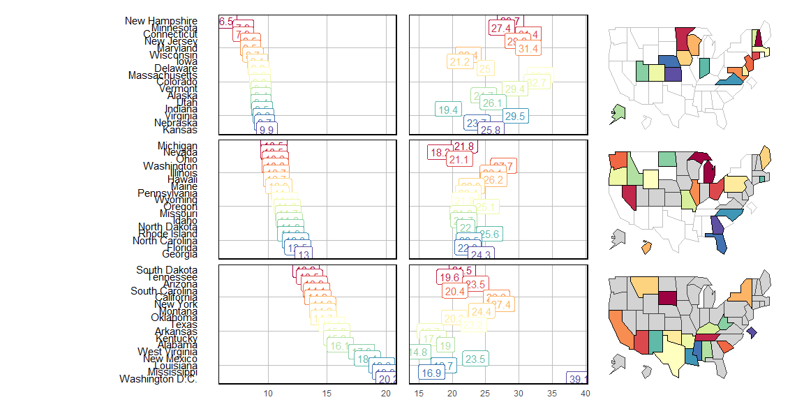
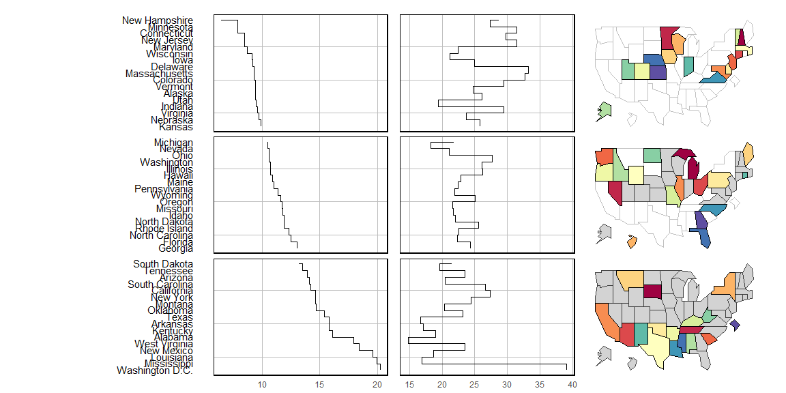
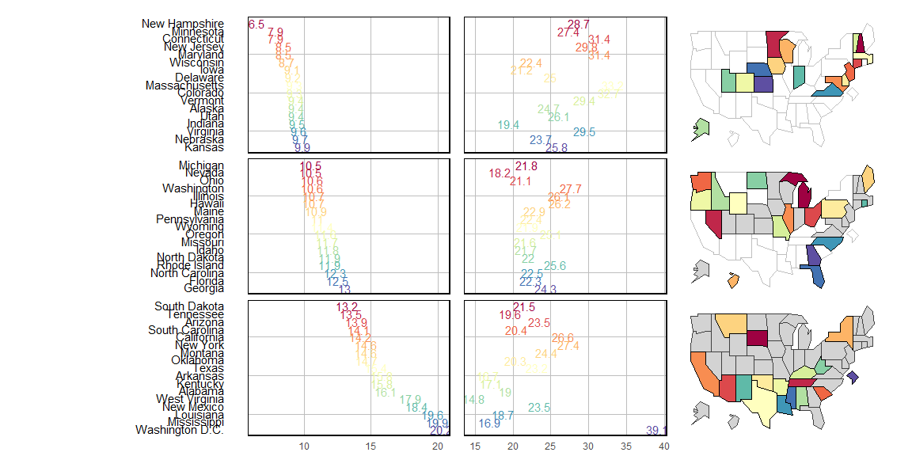
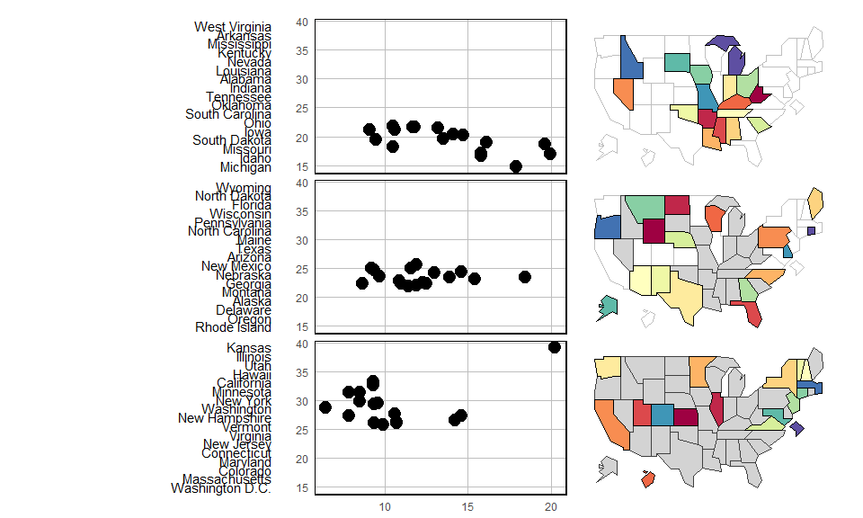
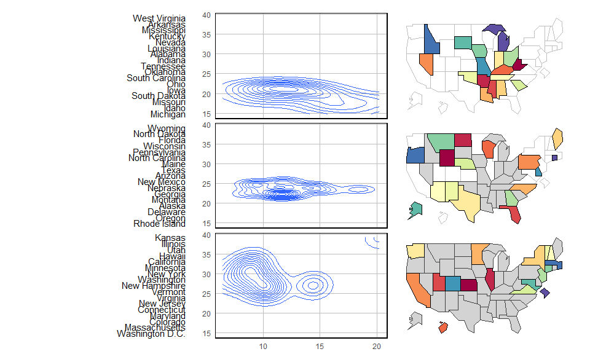
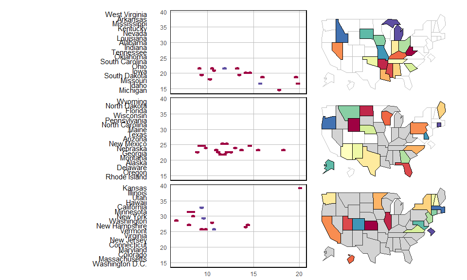

# R-micromap-package-development

[](http://cran.rstudio.com/package=micromap) [](http://ci.appveyor.com/project/fawda123/R-micromap-package-development)

This repository is for development of the USEPA R micromap package.   If you would like to contribute to this repository please follow the guidelines in [CONTRIBUTING](CONTRIBUTING.md).

### Installing the package

Version 1.9.2 is the stable version on CRAN and can be installed as follows.


```r
# install from CRAN
install.packages('micromap')
library(micromap)
```

The development version can be installed from the development branch on the repository.


```r
# requires devools to install
install.packages('devtools')
library(devtools)

# install from repo
install_github('USEPA/R-micromap-package-development', ref = 'development')
library(micromap)
```

### Citation


```r
citation(package = 'micromap')
```

```
## 
## To cite the micromap package in publications use:
## 
##   Quinn C. Payton, Michael G. McManus, Marc H. Weber, Anthony R.
##   Olsen, and Thomas M. Kincaid (2015). micromap: A Package for
##   Linked Micromaps. Journal of Statistical Software, 63(2), 1-16.
##   URL http://www.jstatsoft.org/v63/i02/.
## 
## A BibTeX entry for LaTeX users is
## 
##   @Article{,
##     title = {{micromap}: A Package for Linked Micromaps},
##     author = {Quinn C. Payton and Michael G. McManus and Marc H. Weber and Anthony R. Olsen and Thomas M. Kincaid},
##     journal = {Journal of Statistical Software},
##     year = {2015},
##     volume = {63},
##     number = {2},
##     pages = {1--16},
##     url = {http://www.jstatsoft.org/v63/i02/},
##   }
```

### Using the functions

Please consult the [publication](http://www.jstatsoft.org/v63/i02/) in the Journal of Statistical Software for a general overview of the package.  A vignette is also provided with the development version of the package:


```r
# view vignette
vignette(package = 'micromap')

# open vignette
vignette('Introduction_Guide')
```

The following provides minimal working examples to illustrate functionality provided by the micromap package.


```r
# stat data, data.frame
data('edPov')

# map data
data("USstates") 
statePolys <- create_map_table(USstates, IDcolumn="ST") 

##
# standard
mmplot(stat.data=edPov, map.data=statePolys,
  panel.types=c("labels", "point","point", "map"),
  panel.data=list("state","pov","ed", NA),
  ord.by="pov", grouping=17,
  map.link=c("StateAb","ID"),
  flip = F
)
```


The updated version of the micromap package includes additional ggplot2 geoms for plotting.  The use of appropriate geoms depends on the type of data relationships that can be displayed.  The two most common data relationships are nominal data, such as values by categories, or bivariate relationships, such as standard x/y variable plots.  The geoms in ggplot2 that can be used with micromap are specified in the `panel.types` argument in the `mmplot` or `mmgroupedplot` functions, e.g., `panel.types = c('labels', 'geom_point', 'geom_bar', 'map')`.  The geom can be specified as a character string by the full geom or by ommitting the `'geom_'` text, i.e., `'geom_point'` or `'point'`.

Appropriate geoms for nominal data relationships include:

* `geom_point`


* `geom_bar`



* `geom_jitter`



* `geom_label`



* `geom_line`


* `geom_step`



* `geom_text`



Bivariate plotting in the micromap package is possible by addiing additional variable names to the `panel.data` argument and using an appropriate geom in the `panel.types` argument.  For example, `panel.types=c("labels", "point", "map")` and `panel.data = list("state", c("pov", "ed"), NA)` will produce a scatterplot of poverty  (x) by education (y).  

Appropriate geoms for bivariate relationships include:

* `geom_point`


* `geom_bin2d` number of observations defined by bins in two-dimensions


* `geom_count` number or proportion of observations defined by all combinations in two-dimensions



* `geom_density_2d`



* `geom_hex` Same as `bin2d` but two-dimensional locations are shown as hexagons



* `geom_path` 


### EPA Disclaimer

The United States Environmental Protection Agency (EPA) GitHub project code is provided on an "as is" basis and the user assumes responsibility for its use. EPA has relinquished control of the information and no longer has responsibility to protect the integrity , confidentiality, or availability of the information. Any reference to specific commercial products, processes, or services by service mark, trademark, manufacturer, or otherwise, does not constitute or imply their endorsement, recomendation or favoring by EPA. The EPA seal and logo shall not be used in any manner to imply endorsement of any commercial product or activity by EPA or the United States Government.

By submitting a pull request, you make an agreement with EPA that you will not submit a claim of compensation for services rendered to EPA or any other federal agency.  Further, you agree not to charge the time you spend developing software code related to this project to any federal grant or cooperative agreement.

### License

This project is licensed under the GNU General Public License, [GPL-2](http://cran.r-project.org/web/licenses/GPL-2). 
